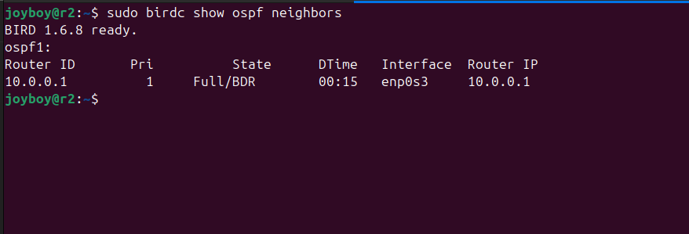
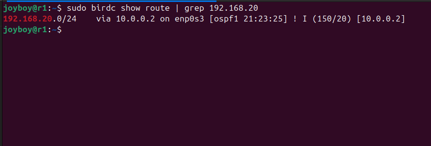
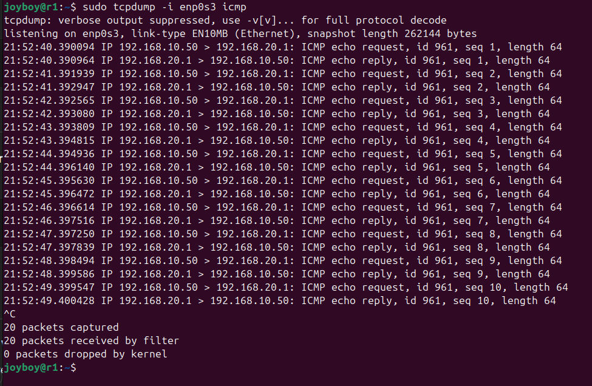
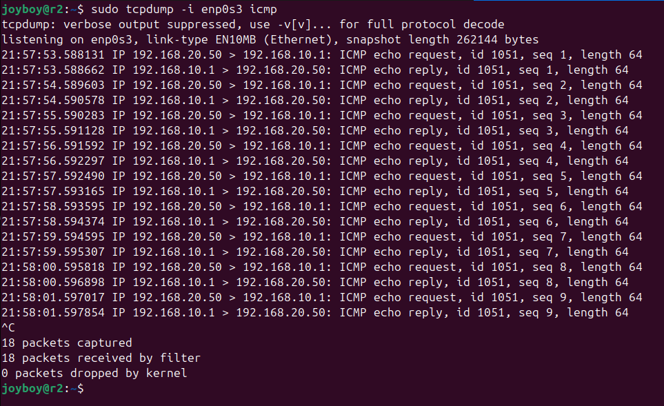
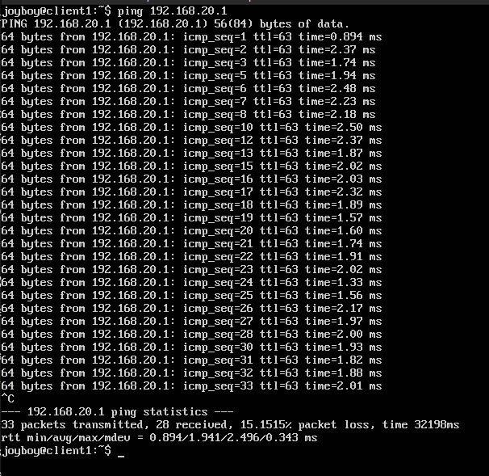

# Enterprise Multi-Site Network Simulation with OSPF and WAN Resilience Testing

## Overview

This project simulates a two-site enterprise network using Ubuntu Server virtual machines in VirtualBox.

The objective was to design, implement, validate, and analyze a routed multi-site network using:

- OSPF dynamic routing (BIRD 1.6)
- Distributed DHCP services (Kea DHCPv4)
- Packet-level traffic inspection
- WAN failure simulation
- WAN degradation (loss and latency) testing
- Control-plane and data-plane validation

The lab replicates real-world enterprise WAN conditions and evaluates routing protocol behavior under both hard failure and controlled impairment scenarios.

---

## Network Topology


- r1 and r2 connected via routed WAN link
- OSPF Area 0 configured between routers
- Independent DHCP service per site
- NAT interfaces used only for package installation

---

## Technologies Used

- Ubuntu Server 24.04 LTS
- VirtualBox
- BIRD 1.6 (OSPFv2)
- Kea DHCPv4
- tcpdump
- tc (netem)
- systemctl
- iproute2

---

# OSPF Implementation

OSPF was selected over static routing to simulate enterprise-scale dynamic routing behavior and to observe reconvergence during link failure and impairment scenarios.

Dynamic routing was implemented using BIRD (OSPFv2).

### OSPF Adjacency (r1)

```
sudo birdc show ospf neighbors
```


State: FULL/DR

### OSPF Adjacency (r2)

```
sudo birdc show ospf neighbors
```



State: FULL/BDR

This confirms successful adjacency formation and LSDB synchronization between routers.

---

## Dynamic Route Propagation

### r1 Learning LAN2

```
sudo birdc show route | grep 192.168.20
```



```
192.168.20.0/24 via 10.0.0.2
```

### r2 Learning LAN1

```
sudo birdc show route | grep 192.168.10
```


```
192.168.10.0/24 via 10.0.0.1
```

Static routes were removed after OSPF validation to ensure full dynamic operation.

---

# DHCP Implementation

Each router runs its own Kea DHCP service for its local subnet.

### r1 DHCP Lease

```
cat /var/lib/kea/kea-leases4.csv
```


Client1 received IP dynamically from the 192.168.10.0/24 pool.

### r2 DHCP Lease

```
cat /var/lib/kea/kea-leases4.csv
```


Client2 received IP dynamically from the 192.168.20.0/24 pool.

This design isolates broadcast domains and prevents cross-site DHCP dependency.

---

# Control Plane vs Data Plane Validation

## Control Plane Validation

- OSPF adjacency state: FULL on both routers
- LSAs exchanged successfully
- Dynamic routes installed in routing tables
- Route withdrawal confirmed during WAN failure

## Data Plane Validation

Packet-level capture performed using:

```
sudo tcpdump -i enp0s3 icmp
```

### r1 Capture



Observed:
- ICMP echo requests from 192.168.10.50
- ICMP echo replies from 192.168.20.1
- No kernel-level packet drops

### r2 Capture



Observed symmetric request/reply traffic across WAN.

This confirms end-to-end forwarding at packet level.

---

# WAN Failure Simulation (Hard Down Event)

WAN interface manually disabled:

```
sudo ip link set enp0s3 down
```

Observed:

- OSPF adjacency dropped
- Remote routes withdrawn
- Inter-site connectivity interrupted

After restoring the interface:

```
sudo ip link set enp0s3 up
```

- OSPF adjacency re-established (FULL)
- Routes dynamically reinstalled
- Connectivity restored automatically

This validates dynamic reconvergence behavior.

---

# WAN Degradation Simulation – Packet Loss

Simulated 15% packet loss on WAN interface:

```
sudo tc qdisc add dev enp0s3 root netem loss 15%
```

Verification:

```
tc qdisc show dev enp0s3
```


Client-side impact:



Observed:

- ~15% packet loss
- Increased RTT variability

Baseline RTT: ~1–2 ms  
Impaired RTT: Variable, with packet drops  
Observed packet loss: ~15%

Despite impairment:

```
sudo birdc show ospf neighbors
```

OSPF adjacency remained FULL.

Conclusion:

Data-plane performance degraded as expected, while OSPF control-plane stability was maintained.

---

# WAN Latency & Jitter Simulation

Simulated WAN delay and jitter:

```
sudo tc qdisc add dev enp0s3 root netem delay 80ms 20ms
```

Observed:

- RTT increased from ~1–2 ms to ~80+ ms
- No OSPF adjacency loss
- No route reconvergence triggered

This demonstrates OSPF resilience under latency and jitter conditions within operational thresholds.

---

# Key Findings

- OSPF maintained stable adjacency under moderate packet loss
- OSPF maintained stability under added latency and jitter
- Dynamic route withdrawal occurred correctly during hard link failure
- Data-plane degradation did not immediately impact control-plane stability
- Distributed DHCP architecture isolated broadcast domains effectively

---

# Skills Demonstrated

- Dynamic routing configuration (OSPFv2)
- Enterprise WAN simulation
- Routing reconvergence testing
- Control-plane vs data-plane analysis
- Traffic impairment simulation using tc netem
- Packet-level inspection with tcpdump
- Linux network diagnostics
- Service validation and log analysis

---

# Engineering Reflection

This lab demonstrates separation of control and data planes in a routed enterprise environment.

OSPF control-plane stability was maintained despite measurable data-plane degradation. Hard link failures triggered proper reconvergence, while moderate loss and latency remained within acceptable operational thresholds.

The project simulates realistic NOC troubleshooting scenarios and validates routing protocol behavior under controlled impairment conditions.