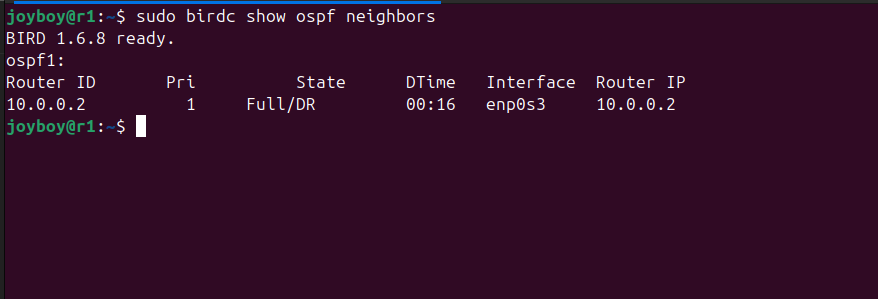
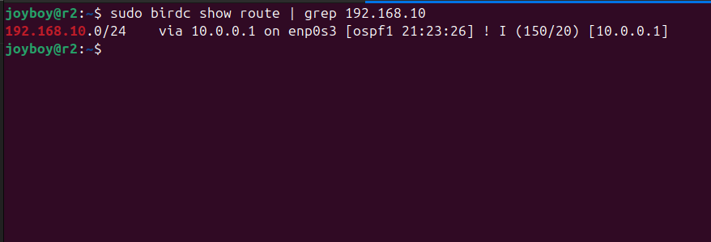
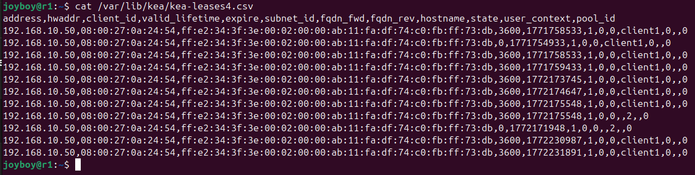
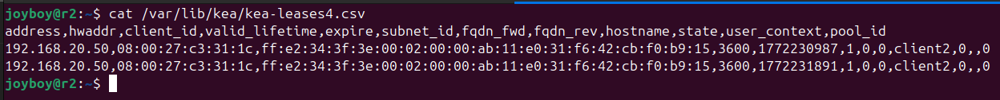
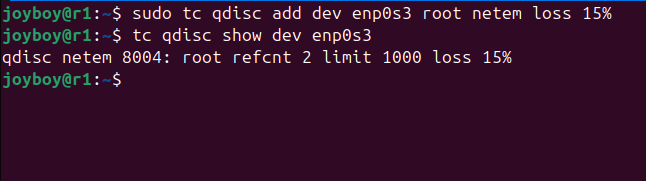

# Enterprise Multi-Site Network Simulation with OSPF and WAN Resilience Testing

## Overview

This project simulates a two-site enterprise network using Ubuntu Server virtual machines in VirtualBox.

The objective was to design, implement, validate, and analyze a routed multi-site network using:

- OSPF dynamic routing (BIRD 1.6)
- Distributed DHCP services (Kea DHCPv4)
- Packet-level traffic inspection
- WAN failure simulation
- WAN degradation (loss and latency) testing
- Control-plane and data-plane validation

The lab was structured to replicate realistic enterprise WAN conditions and observe routing protocol behavior under impairment.

---

## Network Topology

```
Client1 (192.168.10.0/24)
        |
        | LAN1
        |
       r1
        | 10.0.0.0/30 (WAN - OSPF)
       r2
        |
        | LAN2
        |
Client2 (192.168.20.0/24)
```

- r1 and r2 connected via routed WAN link
- OSPF area 0 running between routers
- Independent DHCP per site
- NAT interfaces used only for package installation

---

## Technologies Used

- Ubuntu Server 24.04 LTS
- VirtualBox
- BIRD 1.6 (OSPFv2)
- Kea DHCPv4
- tcpdump
- tc (netem)
- systemctl
- iproute2

---

# OSPF Implementation

Dynamic routing was implemented using BIRD (OSPFv2).

### OSPF Adjacency (r1)

```
sudo birdc show ospf neighbors
```


State: FULL/DR

### OSPF Adjacency (r2)

```
sudo birdc show ospf neighbors
```


State: FULL/BDR

This confirms successful database synchronization and adjacency formation.

---

## Dynamic Route Propagation

On r1:

```
sudo birdc show route | grep 192.168.20
```


Route learned dynamically via OSPF:

```
192.168.20.0/24 via 10.0.0.2
```

On r2:

```
sudo birdc show route | grep 192.168.10
```


Route learned dynamically via OSPF:

```
192.168.10.0/24 via 10.0.0.1
```

Static routes were removed after OSPF validation.

---

# DHCP Implementation

Each site runs its own Kea DHCP service.

### r1 DHCP Lease Proof

```
cat /var/lib/kea/kea-leases4.csv
```


Client1 dynamically assigned IP from 192.168.10.0/24 pool.

### r2 DHCP Lease Proof

```
cat /var/lib/kea/kea-leases4.csv
```


Client2 dynamically assigned IP from 192.168.20.0/24 pool.

This design avoids cross-site broadcast dependency.

---

# Control Plane vs Data Plane Validation

## Control Plane

- OSPF adjacency FULL on both routers
- LSAs exchanged successfully
- Dynamic routes installed in routing table

## Data Plane

Packet capture performed using:
#### r1
```
sudo tcpdump -i enp0s3 icmp
```

Observed:

- ICMP echo request from 192.168.10.50
- ICMP echo reply from 192.168.20.1
- No packet drops at kernel level  

---

### r2

Observed:

- ICMP echo request from 192.168.20.50
- ICMP echo reply from 192.168.10.1
- No packet drops at kernel level  

Confirmed end-to-end routing at packet level.

---

# WAN Failure Simulation

Hard failure simulated:

```
sudo ip link set enp0s3 down
```

Observed:

- OSPF adjacency dropped
- Remote routes withdrawn
- Inter-site connectivity interrupted

After restoring interface:

```
sudo ip link set enp0s3 up
```

- OSPF re-established FULL state
- Routes dynamically reinstalled
- Connectivity restored automatically

---

# WAN Degradation Simulation (Packet Loss)

Simulated 15% packet loss on WAN:

```
sudo tc qdisc add dev enp0s3 root netem loss 15%
```

Verification:

```
tc qdisc show dev enp0s3
```
  


---

Client1 ping results:  


- ~15% packet loss observed
- Increased RTT variability

Despite degradation:

```
sudo birdc show ospf neighbors
```

OSPF adjacency remained FULL.

Conclusion:

Data plane degraded, control plane remained stable.

---

# WAN Latency & Jitter Simulation

Simulated WAN delay:

```
sudo tc qdisc add dev enp0s3 root netem delay 80ms 20ms
```

Observed:

- Increased ping RTT from baseline (~1–2 ms) to ~80+ ms
- OSPF adjacency remained FULL
- No routing reconvergence triggered

This demonstrates routing protocol resilience under latency conditions.

---

# Key Findings

- OSPF maintained stable adjacency under moderate packet loss
- OSPF maintained stability under added latency and jitter
- Dynamic route withdrawal occurred correctly during hard link failure
- Data plane performance degraded predictably under impairment
- Distributed DHCP isolated broadcast domains per site

---

# Skills Demonstrated

- Dynamic routing configuration (OSPFv2)
- Enterprise WAN simulation
- Control-plane validation
- Data-plane packet analysis
- Traffic impairment simulation using tc netem
- Routing behavior analysis under failure conditions
- Linux network diagnostics
- Service management and log inspection

---

# Engineering Reflection

This project demonstrates separation of control and data planes in routed enterprise environments.

Key operational insight:

Routing protocols may remain stable even when the data plane experiences moderate degradation. Hard failures trigger reconvergence, whereas loss and latency within acceptable thresholds do not.

The lab replicates real-world NOC troubleshooting scenarios and provides measurable network behavior under controlled impairment.

---
